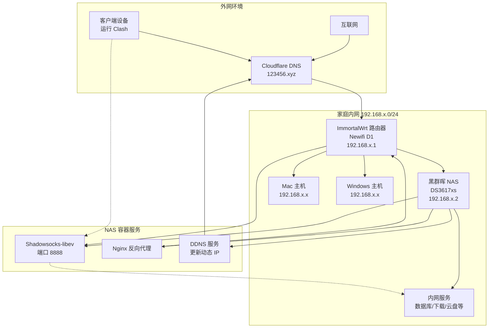

## 🎯 项目目标

- **远程桌面连接** - 能通过远程连接（桌面）家庭局域网中的主机，支持 Mac 和 Windows 系统
- **内网服务访问** - 局域网内主机安装了多种应用服务，如数据库、文件下载、NAS 云盘等，需要外部安全访问
- **安全性保障** - 不通过端口映射方式直接暴露各端口到公网，确保内网安全

## ✨ 技术特点

- 🏗️ **混合架构** - 公网服务直连 + 内网服务代理
- 🧠 **智能选择** - 自动测试延迟选择最优节点
- 🔐 **安全加密** - 使用军用级 xchacha20 加密算法
- 🌐 **稳定连接** - Cloudflare 动态域名确保高可用性

## 🚀 应用场景

- 💼 **远程办公** - 访问公司内网资源
- 🏠 **家庭网络** - 远程管理家庭设备
- ☁️ **混合云服务** - 构建私有云架构
- 🛠️ **开发环境** - 远程调试和开发
## 📊 网络拓扑

下图展示了完整的网络架构设计：

## 🛠️ 硬件 & 软件清单

### 💻 主要设备

- **📶 主路由器** - 一台刷了 ImmortalWrt 的 Newifi D1 路由器
  - 功能：主路由、端口转发、DHCP 分配内网 IP
  
- **💾 NAS 服务器** - 一台星际蜗牛黑群晖 NAS
  - 版本：DS3617xs
  - 服务：Docker、Shadowsocks-libev、Nginx 反向代理、DDNS 服务

### 🌐 网络服务

- **📜 域名服务** - 准备一个域名（示例：123456.xyz）
  - 托管平台：Cloudflare
  - 用途：DNS 解析和动态域名管理
  
- **🔄 客户端软件** - Clash 代理客户端
  - 功能：访问 SS 服务、设置代理组、URL 节点测试
  - 保障：访问内网的安全性

## 🚀 实施步骤

### 1️⃣ 安装路由器系统

#### 📥 固件下载与刷机
- **下载固件** - 从 [ImmortalWrt地址](https://firmware-selector.immortalwrt.org/) 下载符合硬件的固件
  
  
- **刷机流程** - 如果是第一次刷机，请按以下步骤操作：
  1. 将路由器恢复出厂设置
  2. 先安装 Kernel 镜像
  3. 进入系统后，按提示安装 Sysupgrade 镜像

### 2️⃣ 路由器基础配置

#### 💾 存储扩容设置
> ⚠️ **重要提示**：必须先完成存储扩容，否则后续设置会失效

- **SD卡配置** - 插入 16G SD卡，分配存储空间：
  - `1G` → `/overlay` （系统空间、软件包安装）
  - `剩余空间` → `/workspace` （日常使用、File Browser等）
  
- **参考文档** - [挂载点SD卡扩容](https://doc.embedfire.com/openwrt/user_manal/zh/latest/User_Manual/openwrt/storage.html)
  
- **配置效果**：
  

#### 🌐 网络接口配置

**LAN 口设置**：
- 路径：`网络 > 接口 > lan > 编辑`
- IPv4 地址：`192.168.x.1` （主路由地址）
- DHCP 起始：`50` （客户端地址从 192.168.x.50 开始）

**WAN 口设置**：
- 路径：`网络 > 接口 > wan > 编辑`
- 连接方式：`PPPoE` 输入宽带账号密码

#### 🏠 静态IP分配
- **添加静态租约**：`状态 > 概览 > 已分配的 DHCP 租约 > 静态租约`
- **设置静态IP**：`网络 > DHCP/DNS > 静态IP地址分配`
- **示例配置**：将安装 SS 的主机 IP 设置为 `192.168.x.2`

#### 🔄 端口转发配置
- **配置路径**：`网络 > 防火墙 > 端口转发`
- **添加规则**：WAN 端口 `8888` → 内网 `192.168.x.2:8888`

#### 🌍 本地域名解析
- **配置路径**：`网络 > DHCP/DNS > 常规`
- **添加解析**：`/123456.xyz/192.168.x.2`
- **作用**：将域名 `123456.xyz` 指向内网 `192.168.x.2`

### 3️⃣ NAS 服务配置

#### ⚡ DDNS 动态解析
- **执行设备**：使用 NAS 计划任务（Newifi D1 性能有限）
- **功能**：动态 IP 配置到 Cloudflare

#### 🐳 Docker 容器部署
- **镜像获取**：黑群晖需通过镜像站下载后上传
- **容器服务**：安装 shadowsocks-libev

#### 🔐 Shadowsocks 配置
- **端口设置**：`8888` （与路由器端口转发一致）
- **密码生成**：使用 [UUID生成器](https://www.uuidgenerator.net/)
- **加密方式**：`xchacha20-ietf-poly1305`

#### 🔄 Nginx 反向代理
- **配置路径**：`控制面板 > 应用程序门户 > 反向代理服务器`
- **代理规则**：`x.123456.xyz:80` → `192.168.x.1:80`
- **访问方式**：通过 `http://x.123456.xyz` 访问路由器

### 4️⃣ Clash 客户端配置

在原有配置文件基础上，添加以下节点配置

```
# Clash 代理配置文件
proxies:
  - name: 123456-ss                          # 代理节点名称，用于后续引用
    type: ss                                 # 使用 Shadowsocks 协议
    server: 动态域名.123456.xyz              # 代理服务器地址，通过 Cloudflare 动态解析
    port: 8888                               # 代理服务器端口
    cipher: xchacha20-ietf-poly1305          # 加密算法，提供高强度安全保护
    password: password                       # 连接认证密码
    udp: true                                # 启用 UDP 转发，支持 DNS 查询等

proxy-groups:
  - name: 123456-net                         # 代理组名称
    type: url-test                           # 自动测试延迟选择最快节点
    proxies:
      - 123456-ss                            # 包含上面定义的代理节点
    url: 123456.xyz                          # 测试连通性的目标地址
    interval: 300                            # 每 300 秒测试一次延迟

rules:
  - DOMAIN,www.123456.xyz,DIRECT             # www 子域名直连，用于公开博客访问
  - DOMAIN-SUFFIX,123456.xyz,123456-net      # 其他 .123456.xyz 域名走代理，访问内网服务
  - MATCH,DIRECT                             # 其他所有流量直连，正常上网
```
## 🔧 高级使用技巧

### 🚀 SSH 隧道端口转发

通过 Shadowsocks 连接到内网后，主路由器变成跳板机。利用 SSH 隧道技术，将内网设备端口映射到本地，实现灵活的内网服务访问。

#### 💡 基本原理
- **🏗️ 跳板机制** - SS 连接后，路由器成为访问内网的桥梁
- **🔄 端口转发** - 通过 SSH 隧道将远程端口映射到本地端口  
- **👻 透明访问** - 本地应用像访问本地服务一样访问内网服务

#### 📝 命令格式
```
ssh -N -L 本地端口:目标IP:目标端口 用户@跳板机地址
```

#### 🎯 实际使用示例

**多端口映射**：
```
# 映射内网多个服务端口到本地
ssh -N -L 1234:192.168.x.x:1234 -L 5678:192.168.x.x:5678 root@root.123456.xyz
```

**参数详解**：
- `-N` - 不执行远程命令，仅建立隧道
- `-L 1234:192.168.x.x:1234` - 本地 1234 端口转发到内网设备 1234 端口
- `-L 5678:192.168.x.x:5678` - 同时映射多个端口
- `root@root.123456.xyz` - 通过路由器域名以 root 用户连接

#### 📱 实用场景示例

**数据库访问**：
```
# 隧道建立
# 本地连接
mysql -h 127.0.0.1 -P 3306
```

**Web 服务访问**：
```
# 隧道建立  
# 浏览器访问
http://127.0.0.1:8080
```

**远程桌面连接**：
```
# 隧道建立
# RDP 连接
127.0.0.1:3389
```

> 💡 **使用提示**：建立隧道后，通过 `127.0.0.1:端口号` 访问内网服务，就像这些服务运行在本地一样方便！
